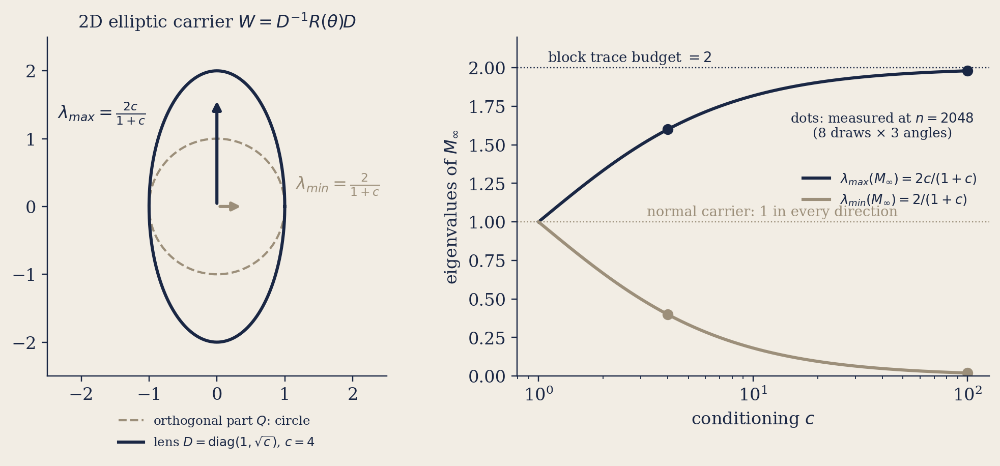
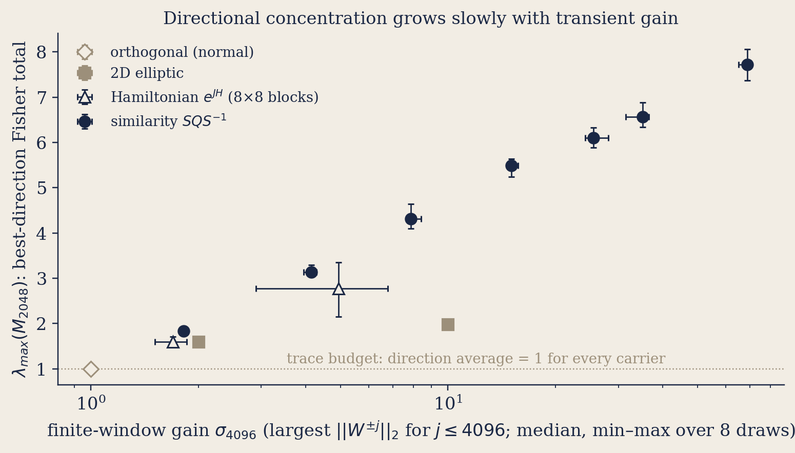
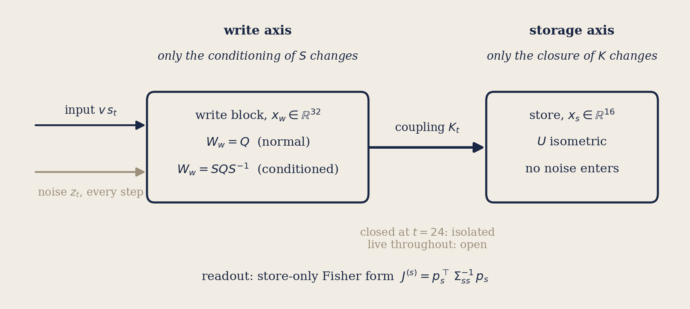
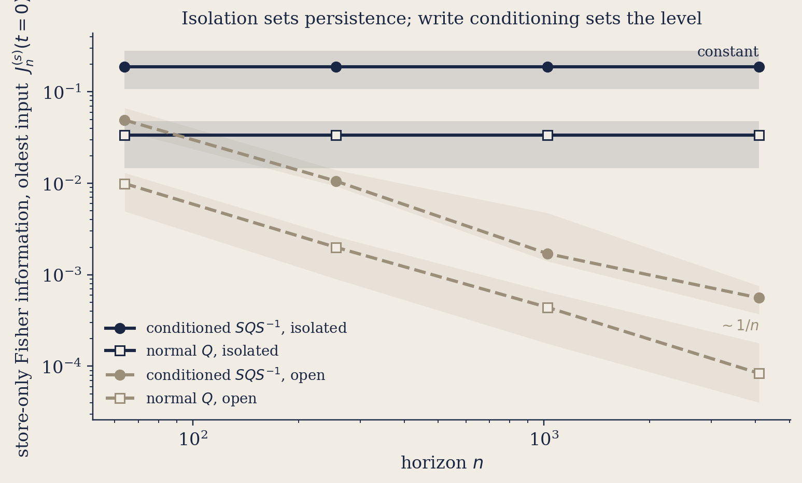

# Non-Normality Allocates Fisher Capacity; Isolation Preserves It
*Finite-horizon certification and end-to-end store design in bi-power-bounded recurrent systems*

**Author:** Jeonghoon Lee, Attractor Dynamics Inc.

## Abstract
We study finite-horizon directional Fisher memory in linear recurrent systems with isotropic process noise. The Fisher-memory matrix has trace exactly \(N\) for every carrier and equals the identity for every normal carrier, so non-normality redistributes a fixed directional budget rather than enlarging its average. For finite-dimensional bi-power-bounded carriers—equivalently, matrices similar to orthogonal ones—we prove uniform \(\Theta(1/n)\) lag-wise Fisher information under continuing loop noise and derive the large-horizon directional matrix by a Cesàro projection onto the commutant of the orthogonal factor. We add a finite-horizon certificate whose error depends explicitly on the smallest spectral-group separation; a near-degenerate control shows why convergence and commutator checks without a gap condition can be misleading. We then propagate the geometry end to end through a finite write interval. An end-to-end store operator selects directions that maximize information actually admitted to the store, increasing the conditioned store total over a write-block oracle by a median factor \(1.224\) across eight paired instances, while one instance loses on the oldest-input objective. After writing, exact isolation makes the complete stored Fisher matrix invariant under any invertible deterministic hold. Under bounded additive contamination \(R_h\preceq \alpha_h A_h\Sigma_0A_h^\top\), the retained information is at least \(1/(1+\alpha_h)\) of its closure value. Sampled generalized-least-squares decoding agrees with the predicted variance and with inverse-adjoint, state-unwarping and propagated readouts under invertible holds. The resulting design separates three stages: directional allocation in the write block, admission into the store, and retention under a declared post-write channel. All experiments are linear and synthetic; no trained neural-network advantage is claimed.

## 1. Introduction
A recurrent memory has to answer three questions that are often collapsed into one: **where** a fixed information budget is allocated during writing, **whether** the selected information reaches a store, and **how** it changes after writing ends. The Fisher memory curve (FMC) of Ganguli, Huh and Sompolinsky [1] answers the first question for stable linear carriers with noise injected inside the loop. For the information about the input \(k\) steps ago, \(J(k)\) is the Fisher information in the current state; its sum is a capacity. They show that normal carriers have total capacity one and that any \(N\)-dimensional carrier has capacity at most \(N\), with extensive capacity arising from strongly non-normal feedforward constructions. Tiňo [12] and Kang, Shirasaka and Suzuki [21] make the write direction explicit in contracting reservoirs.

We use a finite-horizon formulation that remains defined at exact isometry. The main analytic object is a matrix \(M_n\) whose Rayleigh quotient is the total Fisher memory of a unit write direction. Its trace is fixed, but its spectrum need not be. Our first contribution is to characterize that spectrum for the finite-dimensional bi-power-bounded non-normal class. The directional total converges to a closed-form matrix \(M_\infty\), while every individual lag receives asymptotically a \(1/n\) share. Thus deterministic losslessness can coexist with directional concentration but not with a non-vanishing oldest-lag Fisher floor under continuing loop noise.

The asymptotic formula alone is not an operational certificate. Near-degenerate eigenvalue groups can delay the Cesàro projection, so we derive a finite-horizon error bound controlled by the spectral-group gap and require a direct finite-\(n\) cross-check. We then distinguish write geometry from end-to-end store geometry. A direction that is leading for the write block need not be leading after the coupling and store covariance are included. This motivates an end-to-end store operator and separate **allocation**, **admission**, and **retention** stages.

The post-write result is equally specific. If no further coupling or noise enters the store, any known invertible hold—including a contraction—changes coordinates but not exact covariance-aware Fisher information. If bounded additive contamination enters, a quantitative retained-information guarantee follows. These statements do not imply that a fixed, quantized or covariance-mismatched decoder is invariant; we therefore include a sampled decoder check.

The paper's claim is narrow: in this linear-Gaussian class, non-normal write dynamics can concentrate a trace-constrained Fisher budget into selected directions; an end-to-end operator can improve the direction admitted to a finite store; and a separately certified post-write channel determines how the admitted geometry is preserved or degraded. We do not claim that a trained nonlinear model will discover the directions, that Fisher concentration alone yields useful task accuracy, or that every memory architecture should use this decomposition.

## 2. Finite-horizon Fisher-memory setting
Carrier $x_{t+1}=Wx_t+v\,s_t+z_t$ with scalar input $s_t$ (the quantity whose past values the state carries information about), $z_t\sim\mathcal N(0,\epsilon I)$, $\epsilon=1$, unit write vector $v$, $N=32$. With $C_n=\sum_{j=0}^{n-1}W^j(W^j)^\top\succeq I$,
$$J_n(k)=v^\top(W^\top)^kC_n^{-1}W^kv,\qquad J_{tot,n}(v)=v^\top M_nv,\qquad M_n=\sum_{k=0}^{n-1}(W^\top)^kC_n^{-1}W^k.$$
Hypotheses used throughout. The initial state is known, $x_0=0$; an unknown $x_0$ with covariance $\Sigma_0$ would add $W^n\Sigma_0(W^n)^\top$ to $C_n$. The noise variance is $\epsilon=1$; for general $\epsilon$ every Fisher quantity scales by $1/\epsilon$ and $\mathrm{tr}M_n=N/\epsilon$. $J_n(k)$ is the diagonal element of the Fisher information matrix in the input sequence, with all other inputs treated as known, which is the convention of [1]. This is the finite-horizon object; for $\rho(W)=1$ there is no stationary FMC, and nothing below uses one. We report totals at $n\in\{32,128,512,2048\}$ and the **oldest-lag finite-horizon Fisher information** $J_n(n-1)$ at $n\le4096$, together with $nJ_n(n-1)$.

**Definition (bi-power-bounded).** An invertible $W$ is bi-power-bounded if $K_+=\sup_{j\ge0}\|W^j\|_2<\infty$ and $K_-=\sup_{j\ge0}\|W^{-j}\|_2<\infty$. $SQS^{-1}$ with $Q$ orthogonal ($K_\pm\le\mathrm{cond}(S)$) and $e^{JH}$ with $H\succ0$ (similar to orthogonal through $H^{1/2}$) are bi-power-bounded; $0.9Q$ is invertible but not bi-power-bounded.

**Certificates.** Normality defect $\|WW^\top-W^\top W\|_F$; symplectic defect $\|W^\top JW-J\|_F$; $\sigma_{max}=\max_{k\le4096}\|W^k\|_2$ (a lower bound on $K_+$ over the measured horizon).

## 3. Exact directional geometry

### 3.1 Trace budget
\[
\operatorname{tr}M_n
=\operatorname{tr}\!\left(C_n^{-1}\sum_{k<n}W^k(W^k)^\top\right)
=\operatorname{tr}(C_n^{-1}C_n)=N .
\]
Hence the spherical average of \(v^\top M_nv\) over unit write directions is one, and its range is the interval \([\lambda_{\min}(M_n),\lambda_{\max}(M_n)]\). Non-normality can redistribute the budget but cannot raise its direction average. At \(n=1\), \(M_1=I\) for every carrier.

### 3.2 Normal isotropy at finite horizon
If \(W\) is normal, \(C_n\) and every \((W^\top)^kC_n^{-1}W^k\) are simultaneously diagonalizable. Their eigenvalues at a carrier eigenvalue \(\mu\) are
\[
\frac{|\mu|^{2k}}{\sum_{j<n}|\mu|^{2j}},
\]
which sum to one over \(k<n\). Therefore
\[
\boxed{M_n=I}
\]
for every finite horizon and every spectral radius. This finite-horizon identity needs no stability assumption; the original stationary theorem [1] does.

### 3.3 Uniform Fisher-tail bounds and the Cesàro–commutant limit
**Theorem 3.3a (uniform tail bounds).** If \(W\) is bi-power-bounded, with
\[
K_+=\sup_{j\ge0}\|W^j\|_2,\qquad K_-=\sup_{j\ge0}\|W^{-j}\|_2,
\]
then for every unit \(v\), \(n\ge1\), and \(0\le k<n\),
\[
\boxed{\frac{1}{nK_+^2K_-^2}\le J_n(k)\le\frac{K_+^2K_-^2}{n}.}
\]
Thus \(J_n(k)=\Theta(n^{-1})\) uniformly over lags and directions under continuing isotropic loop noise.

**Theorem 3.3b (Cesàro–commutant limit).** Every finite-dimensional bi-power-bounded real matrix can be written
\[
W=SQS^{-1},\qquad Q^\top Q=I.
\]
Set
\[
A=S^{-1}S^{-\top},\qquad
A_n=\frac1n\sum_{j=0}^{n-1}Q^jAQ^{-j},\qquad
\bar A=\Pi_{\operatorname{Comm}(Q)}(A).
\]
Then
\[
\boxed{M_n\longrightarrow M_\infty=S^{-\top}\bar A^{-1}S^{-1}}
\]
and, uniformly over finite-horizon lags,
\[
\boxed{\sup_{0\le k<n}\left|nJ_n(k;v)-v^\top M_\infty v\right|\longrightarrow0.}
\]
At large horizons, every lag receives approximately the same \(1/n\) share of the directional total \(v^\top M_\infty v\).

### 3.4 Finite-horizon certification
Let the distinct complex eigenvalue groups of \(Q\) have projectors \(P_\lambda\) and define
\[
\Delta=\min_{\lambda\ne\mu}|1-\lambda\bar\mu|.
\]
For
\[
\bar A=\sum_\lambda P_\lambda A P_\lambda,
\]
the finite Cesàro average obeys
\[
\boxed{
\|A_n-\bar A\|_F
\le
\delta_n
:=
\frac{2}{n\Delta}\|A-\bar A\|_F .
}
\]
If
\[
\eta_n:=\|\bar A^{-1}\|_2\,\delta_n<1,
\]
then
\[
\boxed{
\|M_n-M_\infty\|_2
\le
\|S^{-1}\|_2^2
\frac{\|\bar A^{-1}\|_2^2\delta_n}{1-\eta_n}.
}
\]
The bound is sufficient and can be conservative. It makes the dependence on near-degenerate eigenvalue groups explicit and provides a rejection rule: when \(n\Delta\) is too small, a finite Cesàro construction is not certified as the commutant projection.

Across the eight paired \(c=10\) instances used below, the actual relative Frobenius error \(\|M_{2048}-M_\infty\|_F/\|M_\infty\|_F\) had median \(8.44\times10^{-6}\) and range \(3.56\times10^{-6}\) to \(1.79\times10^{-5}\); every actual operator-norm error lay below the reported sufficient bound. A four-dimensional near-degenerate control with eigen-angle separation \(10^{-4}\) at \(n=1000\) had
\[
\|A_n-\bar A\|_F=1.599,\qquad
\|A_{2n}-A_n\|_F=0.0799,\qquad
\|[A_n,Q]\|_F=0.00102,
\]
while \(2/(n\Delta)\approx20\). Small two-scale and commutator residuals alone would therefore be an unsafe certificate.

### 3.5 Two-dimensional elliptic corollary
For
\[
W=D^{-1}R(\theta)D,\qquad D=\operatorname{diag}(1,\sqrt c),\qquad \theta\notin\pi\mathbb Z,
\]
the symmetric commutant projection is scalar, giving
\[
\boxed{
M_\infty=\frac{2}{1+c}\operatorname{diag}(1,c),\quad
\lambda_{\max}=\frac{2c}{1+c},\quad
\lambda_{\min}=\frac{2}{1+c}.
}
\]
At \(\theta\in\pi\mathbb Z\), \(W=\pm I\) and \(M_n=I\). The ceiling two is the block trace budget, not a generic consequence of symplecticity.

*Figure 2. The two-dimensional elliptic family and its limiting directional spectrum.*

## 4. Replicated directional-capacity census
$n=2048$ for $M_n$; oracle direction fixed at 2048; medians with [min, max] over draws; full quartiles in the released CSV. **What was randomized per draw:** the orthogonal $Q$; the left and right singular bases of $S$ (its singular values are fixed at $\mathrm{geomspace}(1,c,N)$); the orthogonal mixer of the 2D family; the eigenbasis of $H$ and the orthogonal-symplectic mixer of the Hamiltonian family. The write vector is not randomized because the oracle direction is computed from $M_{2048}$.

| Carrier | cond | $\sigma_{4096}=\max_{j\le4096}\|W^j\|_2$, med | $\lambda_{max}$ (oracle) med [min, max] | $\lambda_{min}$ med | $nJ_n(n-1)$ at $n=4096$, med |
|---|---|---|---|---|---|
| Haar orthogonal | 1 | 1.00 | 1.000 [1.000, 1.000] | 1.000 | 1.000 |
| $SQS^{-1}$ | 2 | 1.82 | 1.831 [1.774, 1.852] | 0.470 | 1.831 |
| | 5 | 4.14 | 3.139 [3.040, 3.298] | 0.133 | 3.138 |
| | 10 | 7.88 | 4.312 [4.098, 4.639] | 0.045 | 4.310 |
| | 20 | 15.0 | 5.491 [5.246, 5.637] | 0.014 | 5.488 |
| | 35 (held-out) | 25.6 | 6.107 [5.892, 6.331] | 0.0054 | 6.105 |
| | 50 | 35.1 | 6.563 [6.343, 6.880] | 0.0029 | 6.559 |
| | 100 | 68.9 | 7.720 [7.366, 8.061] | 0.0008 | 7.713 |
| 2D elliptic, 3 angles | 4 | 2.00 | 1.600 [1.600, 1.600] | 0.400 | 1.600 |
| 2D elliptic, 3 angles | 100 | 10.0 | 1.980 [1.980, 1.980] | 0.0198 | 1.980 |
| $e^{JH}$, 8×8 blocks | 4 | 1.70 | 1.595 [1.468, 1.714] | 0.549 | 1.595 |
| | 100 | 4.94 | 2.771 [2.147, 3.351] | 0.114 | 2.771 |

*Figure 3. Replicated census: best-direction Fisher total $\lambda_{max}(M_{2048})$ against the measured forward finite-window gain $\sigma_{4096}=\max_{0\le j\le4096}\|W^j\|_2$, with medians and min–max ranges over eight draws per configuration. The direction average is one for every point.*

**Readings.** (a) Every instance obeys the finite-window bounds of §3.3 at every lag, and $nJ_n(n-1)$ equals $\lambda_{max}$ within 2% at $n\ge512$ on all 128 instances, as the limit theorem requires. (b) Normality rules out directional concentration above one (§3.2), and every non-normal carrier exhibits some: at $n=2$, $M_2=I+(I+WW^\top)^{-1}-(I+W^\top W)^{-1}$, so $M_2=I$ iff $W$ is normal, and since $\mathrm{tr}M_2=N$ any non-normal $W$ has a direction with $J_{tot,2}>1$. This is an existence statement at horizon two; it does not by itself guarantee a large, robust, or learnably accessible advantage at a chosen operating horizon (§4 measures the size, §8 states the learnability gap). Non-normality alone does not make the gain large or learnably accessible: 8×8 Hamiltonian blocks at $c=4$ reach only 1.6. (c) In the $SQS^{-1}$ family the oracle capacity is monotone in conditioning; an exploratory fit of configuration medians, $\lambda_{max}\approx0.91+1.62\ln\sigma_{4096}$ (train RMSE 0.10 on six conditionings), predicted the held-out $c=35$ median to within 0.05 (6.156 predicted, 6.107 observed). One family; reported as exploratory.

### 4.1 The positive-definite Hamiltonian exponential limits gain by $\sqrt{\kappa(H)}$
$e^{JH}=H^{-1/2}e^{K}H^{1/2}$ with $K$ skew-symmetric, so the similarity transform is $H^{1/2}$ and $K_\pm\le\sqrt{\kappa(H)}$; the observed $\sigma_{4096}$ stays below $\sqrt{\kappa(H)}$ (medians 1.70 at $c=4$, 4.94 at $c=100$, against 2 and 10), which is this parametrization, not a property of symplecticity. Block trace budgets bound $\lambda_{max}$ by the block size (replicated: 1.98 of 2 and 2.77 of 8 at $c=100$; the 4×4 value 1.91 of 4 is from the single-instance run of 2026-09-02 and is not replicated). At matched $\sigma_{4096}$ the Hamiltonian and similarity families are close ($\sigma\approx4.1$: 3.14 versus $\sigma\approx4.9$: 2.77). A symplectic similarity family $SQS^{-1}$ with $S\in Sp$ would be governed by $\mathrm{cond}(S)$ and is not measured here.

## 5. From write geometry to store geometry

### 5.1 Time-varying write–store model
Let the state be \(x=(x_w,x_s)\), where the write block has dimension \(N\) and the store has dimension \(d\). During a finite write interval,
\[
x_{w,t+1}=W_wx_{w,t}+v s_t+z_t,
\]
\[
x_{s,t+1}=K_tx_{w,t}+\Phi_tx_{s,t}.
\]
For an input written at step \(t\), let \(L_t:\mathbb R^N\to\mathbb R^d\) be its accumulated transfer into the store at closure, and let \(C_{ss}\) be the noise-normalized closure covariance of the store.

Define the end-to-end store operator
\[
\boxed{
M_{\mathrm{store}}=\sum_{t\in I}L_t^\top C_{ss}^{-1}L_t.
}
\]
For a unit write direction \(v\), \(v^\top M_{\mathrm{store}}v\) is the total conditioned Fisher information admitted to the store over the declared input set \(I\). It depends on the write dynamics, coupling, write interval, store map during the interval, and closure covariance.

**Proposition 5.1 (store budget).** If the closure covariance can be written
\[
C_{ss}=\sum_{r\in\mathcal N}L_rL_r^\top+C_{\mathrm{add}},\qquad C_{\mathrm{add}}\succeq0,
\]
and \(I\subseteq\mathcal N\), then
\[
\boxed{\operatorname{tr}M_{\mathrm{store}}\le d.}
\]
Equality holds in the full-rank pure inherited-noise case when the signal and noise index sets induce the same covariance. The write-block identity \(\operatorname{tr}M_n=N\) does not automatically transfer to the store.

### 5.2 Paired write-path × isolation factorial
The paired experiment uses \(N=32\), \(d=16\), a 24-step write window, the same Haar orthogonal factor \(Q\) within each pair, and either the normal writer \(Q\) or the conditioned writer \(SQS^{-1}\) with \(\kappa(S)=10\). The store coupling is either left open or set to zero after the write window. No process noise enters the store directly.

*Figure 1. The paired factorial. The paired cells share \(Q\); the conditioned writer applies the sampled similarity transform \(S\). The storage intervention changes only whether the coupling into the store closes after the write window.*

At \(n=4096\), store-only medians over eight paired draws were:

| write carrier | storage | direction | \(J^{(s)}_{\mathrm{tot}}\) | oldest stored input |
|---|---|---:|---:|---:|
| normal \(Q\) | open | conditioned-writer oracle | 0.405 | 0.00008 |
| normal \(Q\) | isolated | conditioned-writer oracle | 0.421 | 0.03375 |
| conditioned \(SQS^{-1}\) | open | conditioned-writer oracle | 2.290 | 0.00056 |
| conditioned \(SQS^{-1}\) | isolated | conditioned-writer oracle | 2.509 | 0.18823 |

The oracle is selected from the conditioned write-block matrix \(M_{2048}\) and shared with the paired normal cell. It is a matched directional intervention, not either store cell's independently optimized direction. In the random direction the ordering reverses (isolated medians \(0.597\) normal and \(0.439\) conditioned), consistent with the fixed trace budget.

*Figure 4. Closing the coupling makes the oldest-input store information constant for both writers. Leaving it open produces strong decay. Conditioning changes the directional level, not the qualitative horizon dependence.*

### 5.3 Store-optimized direction selection
For each of the same eight conditioned writers, we computed both
\[
v_{\mathrm{write}}=\operatorname{eigmax}(M_{2048})
\]
and
\[
v_{\mathrm{store}}=\operatorname{eigmax}(M_{\mathrm{store}}).
\]
The store trace was \(16\) to numerical precision in every draw. The ratio
\[
\frac{v_{\mathrm{store}}^\top M_{\mathrm{store}}v_{\mathrm{store}}}
{v_{\mathrm{write}}^\top M_{\mathrm{store}}v_{\mathrm{write}}}
\]
had median \(1.224\) and range \(1.112\)–\(1.582\). The corresponding oldest-input information ratio had median \(1.257\) and range \(0.922\)–\(1.762\): maximizing the total caused one individual loss on the oldest input. Every selected store direction still had write-block allocation above \(1.05\) (median \(3.70\), range \(3.11\)–\(4.29\)) and nonzero transfer of the designated oldest input.

The conclusion is therefore qualified:

> End-to-end selection improves the declared **store-total** objective algebraically, but it does not dominate every lag-specific objective. The objective and its required side constraints must be declared before direction selection.

## 6. Post-write retention and decoded readout

### 6.1 Exact post-write invariance
Let \(P_0\) contain closure-time sensitivities of stored writes and let \(\Sigma_0\succ0\) be the closure covariance. If, after closure, no further coupling or disturbance enters the store and the known hold is invertible,
\[
P_h=A_hP_0,\qquad \Sigma_h=A_h\Sigma_0A_h^\top,
\]
then the full stored Fisher matrix is invariant:
\[
\boxed{
P_h^\top\Sigma_h^{-1}P_h=P_0^\top\Sigma_0^{-1}P_0.
}
\]
This holds for orthogonal, expanding and contracting invertible holds. Contraction after closure is a change of coordinates in exact covariance-aware arithmetic; contraction during writing changes what is written.

### 6.2 Approximate-isolation guarantee
Suppose the sensitivity remains \(p_h=A_hp_0\), while an additive post-write disturbance contributes covariance \(R_h\) satisfying
\[
0\preceq R_h\preceq \alpha_h A_h\Sigma_0A_h^\top.
\]
Then
\[
\Sigma_h=A_h\Sigma_0A_h^\top+R_h
\preceq
(1+\alpha_h)A_h\Sigma_0A_h^\top,
\]
and inverse order gives
\[
\boxed{
\frac{J_0}{1+\alpha_h}\le J_h\le J_0.
}
\]
Consequently, a retained fraction \(\beta_{\mathrm{ret}}\) is guaranteed whenever
\[
\alpha_h\le\beta_{\mathrm{ret}}^{-1}-1.
\]
The same bound applies to nuisance-projected information by minimizing the corresponding quadratic form over nuisance coefficients.

We tested the bound on eight stores at \(\alpha\in\{0.05,0.25,1\}\), using both aligned disturbances \(R=\alpha\Sigma_0\), which attain equality, and random positive-semidefinite disturbances bounded by \(\alpha\Sigma_0\). All 48 checks passed; the minimum numerical margin was \(-4.4\times10^{-16}\).

Residual coupling is not covered by this inequality. It changes the designated sensitivity, injects later inputs and write-path noise, and can create cross-covariance with the closure state. Such a branch requires full joint propagation and a recomputed decoder.

### 6.3 Sampled generalized-least-squares decoder
For each draw we used \(v_{\mathrm{store}}\), stored one unknown scalar input, generated 5,000 closure states, and applied the scalar GLS decoder
\[
a_0=\frac{\Sigma_0^{-1}p_0}{p_0^\top\Sigma_0^{-1}p_0},\qquad
\hat s=a_0^\top x_s.
\]
Across the eight draws, the sampled error variance divided by the theoretical value \(1/J_0\) had median \(1.017\) and range \(0.969\)–\(1.032\); the sampled bias lay between \(-1.19\) and \(1.04\) standard errors.

We then propagated the same realized states through \(U^H\) and \(0.9^HU^H\) at \(H\in\{200,700\}\). Three readings—
1. inverse-adjoint decoder propagation,
2. state unwarping followed by the closure decoder, and
3. GLS recomputation from propagated sensitivity and covariance—

all reproduced the closure estimate, with maximum absolute discrepancy \(8.0\times10^{-15}\).

This experiment validates the declared scalar Gaussian readout. It does not establish joint recovery of many unknown inputs or invariance of a fixed, quantized, clipped or covariance-mismatched decoder.

## 7. Implications: allocation, admission and retention
The results support a three-stage information geometry.

1. **Allocation.** The write-block operator \(M_n\) or \(M_\infty\) describes how a fixed trace budget is distributed over write directions. Normal carriers are isotropic; non-normal carriers can create directions above the average at the expense of others.

2. **Admission.** The end-to-end operator \(M_{\mathrm{store}}\) includes the coupling and closure covariance. A write-block oracle need not be a store oracle. Direction selection should use the objective actually required at the store and retain a write-allocation and transfer constraint.

3. **Retention and readout.** Exact isolation preserves the complete Fisher matrix under an invertible hold. Bounded additive contamination gives a quantitative retained-information floor. Residual coupling, observation noise, non-invertible channels, quantization and finite precision require separate accounting.

The controls are separable in **role**, not independent in magnitude. Write geometry changes the direction and level of admitted information; the post-write channel determines whether that geometry is preserved, contaminated or discarded. Coupling and storage choices can also change the absolute level, so no universal multiplicative independence is claimed.

## 8. Limitations and open experiments
All systems are linear and synthetic. The directional census uses \(N=32\), eight instances per configuration, one process-noise model and a post-hoc oracle direction. The store experiments use one conditioning level, one coupling family, a 16-dimensional store and one scalar conditioned-input decoder. The log relationship between transient gain and oracle capacity is exploratory and family-specific.

The finite-horizon certificate can be conservative; the direct \(M_n\) cross-check remains necessary when the spectral-group gap is small. The end-to-end store oracle optimizes a total and does not guarantee improvement for every lag. The approximate-isolation theorem assumes an additive covariance order and zero residual coupling. The sampled decoder assumes a correctly specified covariance and one unknown scalar.

Most importantly, no trained recurrent network has been shown to discover the high-information directions, maintain the assumed noise model, or improve downstream task utility. A Fisher-level advantage can coexist with poor decoded accuracy when the absolute signal-to-noise ratio is too small. The next empirical question is therefore not whether the algebraic oracle exists, but whether a learned system can align writes and coupling with it under matched resource and task constraints.

## 9. Related work
**Fisher memory of linear carriers.** Ganguli, Huh and Sompolinsky [1] introduced the FMC with in-loop noise and proved, under stability, that normal carriers have total capacity one and any carrier at most $N$, with extensive capacity reached only by strongly non-normal feedforward constructions. Orhan and Pitkow [3] restate the normal-matrix result and reach order-$N$ capacity with decaying non-normal constructions; Hennequin, Vogels and Gerstner [2] give the variance-amplification analogue (normal ⇒ no transient amplification). Tiňo [12] proves, for symmetric contracting Wigner carriers, that memory over $k\ge1$ is maximized by writing along the dominant eigenvector, the precedent for our write-direction question, with a different mechanism (slowest normal mode versus redistribution of a fixed trace). Kerg et al. [5] parameterize a broad Schur class with unit or near-unit eigenspectra and non-orthogonal eigenbases, with orthogonal matrices as a subset. Their reported Fisher-memory calculations (their Proposition 1 and Table 6, $J_{tot}$ from 3.0 to 20.5) focus on strictly lower-triangular chains with optional diagonal, i.e. nilpotent or contracting examples. We did not locate in that paper a Fisher-memory characterization that isolates the finite-dimensional bi-power-bounded non-normal subclass studied here; we do not characterize their full parameterization as non-bi-power-bounded. Kang, Shirasaka and Suzuki [21] take the write-direction rule of [1], the top eigenvector of the Fisher memory matrix, and use it to optimize the input mask of a Mackey–Glass time-delay reservoir under white state noise. Their carrier is a contracting delay loop. They note that the mask changes the performance of a fixed capacity, not the capacity itself, which is the trace budget of §3.1 seen from the reservoir side.

**Reconstruction memory and its completeness identities.** Jaeger [15, 17] defines the reconstruction memory capacity and proves $\mathrm{MC}\le N$, with equality iff the Krylov matrix of the write vector has full rank. In noise experiments he attributes the collapse of memory under state noise to iterates $W^k$ collapsing onto a low-dimensional subspace and forcing large output weights, which near-unitary $W$ avoids. This is non-normal transient geometry seen from the reconstruction side, where it destroys capacity; the Fisher functional sees it as concentration of a fixed trace. White, Lee and Sompolinsky [13] use the same in-loop dynamics with a signal-plus-noise covariance; their Eq. (4), Dambre et al.'s completeness theorem [19, Thm. 7] and Guan et al.'s $M_{sum}=N$ [18, supp. Eq. 108] are the reconstruction-side cousins of §3.1's trace budget. In White et al. orthogonal carriers are extensive with an optimum just below exact reversibility, and random Gaussian carriers are not; the two functionals differ in where the covariance puts the signal, not in the noise model. Hermans and Schrauwen [16] show that without noise the reconstruction memory function depends only on the eigenvalues of $W$ and is similarity-invariant, the opposite of the in-loop-noise Fisher setting, where similarity by $S$ is exactly what moves capacity between directions. Haruna and Nakajima [10] bound the reconstruction memory function from below by a harmonic memory $h(k)=\|p_k\|^2/(p_k^\top Cp_k)$, a Cramér–Rao form, with equality iff the eigenvalues of the state covariance are constant on the support of the write direction's projection. They observe that for random Gaussian (non-normal) reservoirs the inequality is strict because the noise and signal covariances do not share eigenvectors. That is a non-normality signature in the reconstruction functional and the nearest published statement to §3.1's directional spreading. Guan et al. [18] show that memory lost to input-channel noise is fixed by the noise power spectrum.

**Persistence, stability and marginal dynamics.** Toyoizumi and Abbott [14] find that memory lifetime diverges at the edge of chaos only without internal noise. The curse-of-memory results [8] and reversible RNNs [7] state, for different reasons, that stable approximation forces decay and that reversible networks cannot forget; UnICORNN [9] is a working time-invertible Hamiltonian recurrent network with no capacity statement. Goldman [6] obtains memory without feedback from purely feedforward (nilpotent) structure, the extensive-capacity construction in its cleanest form. In the sources reviewed, we did not locate the combination of the bi-power-bounded limit theorem, finite-horizon certification, end-to-end store-direction selection, and post-write retention guarantees stated here. The invariance theorem itself is a standard property of Fisher information under invertible transformations; the contribution is its placement inside an allocation–admission–retention design and certification chain.

**Covariance-tracking memories and readouts.** The readout of §§5–6 propagates the stored mean and covariance through the post-closure map and reads the Fisher form; these are the standard operations of Kalman covariance propagation, and the contribution is the invariance statement, not the operations. Becker et al. [25] propagate a factorized latent covariance inside a recurrent network for uncertainty-aware fusion. Dowling, Jeon, Savin and Park [24] derive recurrent layers from an explicit memory design model. Their linear-Gaussian Bayesian Layer propagates mean and covariance, and uses the covariance to steer writes toward uncertain directions and protect confident ones. It recovers linear attention, gated linear attention (GLA) and Mamba-2 as exact filters, and DeltaNet as a covariance-reset reduction. It is a close architecture-level neighbor because it also makes covariance part of the memory state. Its purpose is Bayesian filtering and uncertainty-aware writing; our purpose is to characterize a trace-constrained directional Fisher geometry, propagate it through a declared coupling, and certify the post-write channel. Fast weights [22] and xLSTM [23] expose a learning rate and a decay rate as separate controls, which is the pair the §6.1–6.2 analysis addresses. Beuria and Shukla [26] build a reservoir from exactly discretized damped rotations, so that rotation and decay are separate design variables and the operator is normal by construction. By the normal-isotropy theorem of §3.2 such a reservoir allocates exactly one unit of Fisher information to every write direction at every horizon. Its separation is spectral, not the write-path/storage-path separation of this paper, and it cannot concentrate.

**Black-box Fisher-information-rate estimation.** Shi and Rojas [28] estimate the Fisher information rate of a process with memory from simulator output by combining local KL-divergence curvature, context-tree weighting and least-squares matrix recovery. Their parameter-Fisher information rate is a different object from the past-input Fisher memory studied here. It is nevertheless complementary: their method addresses how to estimate an information geometry when only simulator output is available, whereas this paper derives and certifies the geometry of a declared linear recurrent memory and uses it to choose write and store directions.

**Projection and memory kernels.** Wang, Benner and Heiland [20] derive, for a partially observed linear time-invariant system with $P f(x_1,x_2)=f(x_1,0)$, the closed-form Mori–Zwanzig decomposition into Markovian term $A_{11}x_1$, noise term $A_{12}e^{tA_{22}}x_2(0)$ and memory kernel $K(s)=A_{12}e^{sA_{22}}A_{21}$, and note it coincides with the variation-of-constants formula. Their closed kernel is a direct mathematical neighbor of the read–transport–write maps used here. Our contribution in the present paper is not a new elimination identity, but the directional Fisher allocation, store-operator selection, and post-write certification layered on top of a declared recurrent memory.

## 10. Reproducibility
The v1.2 package contains the v1.1 census and factorial scripts and a new public strengthening script,
`preprint_v1_2_strengthening_20260917.py`, which regenerates:

- finite-horizon certification checks and the near-degenerate control;
- the end-to-end store operator and store-oracle comparison;
- sampled decoder tests under \(U^H\) and \(0.9^HU^H\);
- randomized approximate-isolation checks.

All experiments use NumPy/float64 and fixed seeds. The original instrument and its receipts are released as Supplementary Material S1 [11]. The strengthening run uses eight paired instances and 5,000 decoder trials per instance and emits JSON/CSV artifacts plus a SHA-256-bound receipt. The public package separates the current manuscript and claim-bearing artifacts from superseded internal notes. Full commands and software requirements are in `REPRODUCE.md`.

## Acknowledgements and AI-assistance statement
AI tools were used, under the author's direction, for derivation checking, code, literature organization and drafting. The author conceived and selected the research questions, verified the proof arguments, re-executed the computations and takes responsibility for the manuscript.

## References

1. S. Ganguli, D. Huh, H. Sompolinsky. Memory traces in dynamical systems. *Proc. Natl. Acad. Sci. USA* 105(48):18970–18975 (2008). doi:10.1073/pnas.0804451105.
2. G. Hennequin, T. P. Vogels, W. Gerstner. Non-normal amplification in random balanced neuronal networks. *Phys. Rev. E* 86:011909 (2012). arXiv:1204.2945.
3. A. E. Orhan, X. Pitkow. Improved memory in recurrent neural networks with sequential non-normal dynamics. *ICLR 2020*. arXiv:1905.13715.
4. M. Asllani, R. Lambiotte, T. Carletti. Structure and dynamical behavior of non-normal networks. *Sci. Adv.* 4(12):eaau9403 (2018).
5. G. Kerg, K. Goyette, M. Puelma Touzel, G. Gidel, E. Vorontsov, Y. Bengio, G. Lajoie. Non-normal recurrent neural network (nnRNN): learning long time dependencies while improving expressivity with transient dynamics. *NeurIPS 32* (2019). arXiv:1905.12080.
6. M. S. Goldman. Memory without feedback in a neural network. *Neuron* 61(4):621–634 (2009).
7. M. MacKay, P. Vicol, J. Ba, R. Grosse. Reversible recurrent neural networks. *NeurIPS 31* (2018). arXiv:1810.10999.
8. Z. Li, J. Han, W. E, Q. Li. On the curse of memory in recurrent neural networks: approximation and optimization analysis. *ICLR 2021*. arXiv:2009.07799.
9. T. K. Rusch, S. Mishra. UnICORNN: a recurrent model for learning very long time dependencies. *ICML 2021*. arXiv:2103.05487.
10. T. Haruna, K. Nakajima. Memory uncertainty relation and harmonic memory in random recurrent networks. arXiv:2605.24628 (2026).
11. Supplementary Material S1. Finite-horizon Fisher-memory scripts, frozen result tables, receipts and public reproduction entry point released with this paper.
12. P. Tiňo. Fisher memory of linear Wigner echo state networks. *ESANN 2017*, pp. 87–92, i6doc.com, ISBN 978-287587039-1.
13. O. L. White, D. D. Lee, H. Sompolinsky. Short-term memory in orthogonal neural networks. *Phys. Rev. Lett.* 92(14):148102 (2004). arXiv:cond-mat/0402452.
14. T. Toyoizumi, L. F. Abbott. Beyond the edge of chaos: amplification and temporal integration by recurrent networks in the chaotic regime. *Phys. Rev. E* 84:051908 (2011).
15. H. Jaeger. Short term memory in echo state networks. GMD Report 152, GMD – Forschungszentrum Informationstechnik, Sankt Augustin (2002).
16. M. Hermans, B. Schrauwen. Memory in linear recurrent neural networks in continuous time. *Neural Networks* 23(3):341–355 (2010). doi:10.1016/j.neunet.2009.08.008.
17. H. Jaeger. The "echo state" approach to analysing and training recurrent neural networks, with an erratum note. GMD Report 148, German National Research Center for Information Technology (2001; corrected 2010).
18. J. Guan, T. Kubota, Y. Kuniyoshi, K. Nakajima. How noise affects memory in linear recurrent networks. *Phys. Rev. Research* 7:023049 (2025). arXiv:2409.03187.
19. J. Dambre, D. Verstraeten, B. Schrauwen, S. Massar. Information processing capacity of dynamical systems. *Sci. Rep.* 2:514 (2012). doi:10.1038/srep00514.
20. F. Wang, P. Benner, J. Heiland. Partial observation of linear systems with the Mori-Zwanzig formalism. arXiv:2606.23341 (2026).
21. Z. Kang, S. Shirasaka, H. Suzuki. Optimizing input mask for maximum memory performance of time-delay reservoir subjected to state noise. *Nonlinear Theory and Its Applications, IEICE* 12(4):662 ff. (2021). doi:10.1587/nolta.12.662.
22. J. Ba, G. Hinton, V. Mnih, J. Z. Leibo, C. Ionescu. Using fast weights to attend to the recent past. *NeurIPS 29* (2016). arXiv:1610.06258.
23. M. Beck, K. Pöppel, M. Spanring, A. Auer, O. Prudnikova, M. Kopp, G. Klambauer, J. Brandstetter, S. Hochreiter. xLSTM: Extended long short-term memory. *NeurIPS 37* (2024). arXiv:2405.04517.
24. M. Dowling, H. Jeon, C. Savin, I. M. Park. Memory by design: probabilistic sequence layers. arXiv:2605.31163 (2026).
25. P. Becker, H. Pandya, G. Gebhardt, C. Zhao, J. Taylor, G. Neumann. Recurrent Kalman networks: factorized inference in high-dimensional deep feature spaces. *ICML 2019*. arXiv:1905.07357.
26. J. Beuria, A. Shukla. Lindblad-inspired multi-timescale reservoir computing with separable rotation and dissipation. arXiv:2608.04028 (2026).
27. A. Behrouz, P. Zhong, V. Mirrokni. Titans: learning to memorize at test time. arXiv:2501.00663 (2025).
28. Y. Shi, C. R. Rojas. Universal estimation of the Fisher information for processes with memory. arXiv:2609.14582 (2026).

## Appendix A. Proofs

### A.1 Trace budget
Because \(C_n=\sum_{j<n}W^j(W^j)^\top\succeq I\),
\[
\operatorname{tr}M_n
=\sum_{k<n}\operatorname{tr}\!\left(C_n^{-1}W^k(W^k)^\top\right)
=\operatorname{tr}(C_n^{-1}C_n)=N.
\]

### A.2 Normal isotropy
For normal \(W=U\Lambda U^*\),
\[
C_n=U\left(\sum_{j<n}|\Lambda|^{2j}\right)U^*.
\]
The diagonal contribution of eigenvalue \(\mu_i\) at lag \(k\) is
\[
|\mu_i|^{2k}/\sum_{j<n}|\mu_i|^{2j},
\]
whose sum over \(k<n\) is one. Therefore \(M_n=I\).

### A.3 Uniform tail bounds
Bi-power-boundedness gives
\[
nK_-^{-2}I\preceq C_n\preceq nK_+^2I
\]
and therefore
\[
\frac1{nK_+^2}I\preceq C_n^{-1}\preceq\frac{K_-^2}{n}I.
\]
Together with \(K_-^{-1}\le\|W^kv\|\le K_+\), this yields Theorem 3.3a.

### A.4 Cesàro–commutant limit
A finite-dimensional bi-power-bounded real \(W\) is similar to an orthogonal matrix. One self-contained construction uses
\[
H_n=\frac1n\sum_{j<n}(W^j)^\top W^j.
\]
Any convergent subsequence has a positive-definite limit \(H\) satisfying \(W^\top HW=H\); then \(Q=H^{1/2}WH^{-1/2}\) is orthogonal.

With \(W=SQS^{-1}\) and \(A=S^{-1}S^{-\top}\),
\[
C_n=nSA_nS^\top,\qquad
A_n=\frac1n\sum_{j<n}Q^jAQ^{-j}.
\]
The Cesàro mean kills cross terms between distinct eigenvalue groups of \(Q\) and converges to \(\bar A=\Pi_{\operatorname{Comm}(Q)}A\). Substitution gives Theorem 3.3b.

### A.5 Finite-horizon certification
Let \(Q=\sum_\lambda\lambda P_\lambda\). Then
\[
A_n-\bar A
=
\sum_{\lambda\ne\mu}
c_n(\lambda\bar\mu)P_\lambda A P_\mu,
\quad
c_n(z)=\frac{1-z^n}{n(1-z)}.
\]
Since \(|c_n(z)|\le2/(n|1-z|)\), and the spectral blocks are orthogonal in Frobenius inner product,
\[
\|A_n-\bar A\|_F
\le
\frac{2}{n\Delta}\|A-\bar A\|_F.
\]
If \(\|\bar A^{-1}\|\delta_n<1\), the standard inverse-perturbation bound gives
\[
\|A_n^{-1}-\bar A^{-1}\|
\le
\frac{\|\bar A^{-1}\|^2\delta_n}
{1-\|\bar A^{-1}\|\delta_n}.
\]
Finally,
\[
M_n
=
S^{-\top}
\left(\frac1n\sum_{k<n}Q^{-k}A_n^{-1}Q^k\right)
S^{-1},
\]
and averaging orthogonal conjugates does not increase the operator norm.

### A.6 Two-dimensional corollary
For an irreducible planar rotation the symmetric commutant is the scalar matrices, so
\[
\bar A=\tfrac12\operatorname{tr}(A)I.
\]
Taking \(S=D^{-1}\), \(A=D^2=\operatorname{diag}(1,c)\), gives the formula in §3.5.

### A.7 Horizon-two identity
\[
C_2=I+WW^\top,
\]
and the push-through identity gives
\[
M_2
=
I+(I+WW^\top)^{-1}-(I+W^\top W)^{-1}.
\]
Thus \(M_2=I\) iff \(W\) is normal. Since \(\operatorname{tr}M_2=N\), every non-normal \(W\) has at least one direction above one and one below one at horizon two.

### A.8 Store budget
Let \(C_{\mathrm{sig}}=\sum_{t\in I}L_tL_t^\top\). Under the hypotheses of Proposition 5.1,
\[
0\preceq C_{\mathrm{sig}}\preceq C_{ss}.
\]
Therefore
\[
\operatorname{tr}M_{\mathrm{store}}
=
\operatorname{tr}(C_{ss}^{-1}C_{\mathrm{sig}})
\le
\operatorname{tr}I_d=d.
\]

### A.9 Exact and approximate isolation
Exact invariance follows by direct congruence:
\[
(A P)^\top(A\Sigma A^\top)^{-1}(A P)=P^\top\Sigma^{-1}P.
\]
For the approximate bound,
\[
\Sigma_h\preceq(1+\alpha_h)A_h\Sigma_0A_h^\top
\]
implies
\[
\Sigma_h^{-1}\succeq\frac1{1+\alpha_h}A_h^{-\top}\Sigma_0^{-1}A_h^{-1},
\]
which yields \(J_h\ge J_0/(1+\alpha_h)\). Since \(R_h\succeq0\), also \(J_h\le J_0\).

### A.10 Scalar GLS readout
For \(x=p s+\eta\), \(\eta\sim\mathcal N(0,\Sigma)\), the unbiased minimum-variance linear coefficient is
\[
a=\frac{\Sigma^{-1}p}{p^\top\Sigma^{-1}p},
\]
and its error variance is \(1/(p^\top\Sigma^{-1}p)\). Under an invertible hold, inverse-adjoint propagation, state unwarping and GLS recomputation are algebraically identical.

## Appendix B. Replicated directional census, full statistics (8 independent matrix instances per configuration; generated from the result CSVs)

B.1 Spectral and gain statistics at $n=2048$ ($\lambda_{max}$, $\lambda_{min}$ of $M_{2048}$; $\mathrm{tr}M_{2048}/N$; finite-window $\sigma_{4096}=\max_{j\le4096}\|W^{\pm j}\|_2$ reported as `K_plus`, `K_minus`).

| configuration | metric | median | Q1 | Q3 | min | max | n |
|---|---|---|---|---|---|---|---|
| A0 | lambda_max | 1 | 1 | 1 | 1 | 1 | 8 |
| A0 | lambda_min | 1 | 1 | 1 | 1 | 1 | 8 |
| A0 | trace_over_N | 1 | 1 | 1 | 1 | 1 | 8 |
| A0 | K_plus | 1 | 1 | 1 | 1 | 1 | 8 |
| A0 | K_minus | 1 | 1 | 1 | 1 | 1 | 8 |
| SQS-c2 | lambda_max | 1.83134 | 1.78732 | 1.83805 | 1.77414 | 1.85209 | 8 |
| SQS-c2 | lambda_min | 0.470081 | 0.460785 | 0.473855 | 0.457123 | 0.475268 | 8 |
| SQS-c2 | trace_over_N | 1 | 1 | 1 | 1 | 1 | 8 |
| SQS-c2 | K_plus | 1.81775 | 1.8147 | 1.82557 | 1.80592 | 1.83847 | 8 |
| SQS-c2 | K_minus | 1.82148 | 1.81407 | 1.82802 | 1.79142 | 1.83944 | 8 |
| SQS-c5 | lambda_max | 3.13892 | 3.08368 | 3.23637 | 3.03958 | 3.29784 | 8 |
| SQS-c5 | lambda_min | 0.13293 | 0.132166 | 0.135387 | 0.125704 | 0.142916 | 8 |
| SQS-c5 | trace_over_N | 1 | 1 | 1 | 1 | 1 | 8 |
| SQS-c5 | K_plus | 4.14197 | 4.11157 | 4.18571 | 3.94781 | 4.27934 | 8 |
| SQS-c5 | K_minus | 4.13054 | 4.09408 | 4.21292 | 4.01679 | 4.30329 | 8 |
| SQS-c10 | lambda_max | 4.31172 | 4.23504 | 4.46172 | 4.09835 | 4.63897 | 8 |
| SQS-c10 | lambda_min | 0.0451568 | 0.0436136 | 0.0462884 | 0.0416706 | 0.0483073 | 8 |
| SQS-c10 | trace_over_N | 1 | 1 | 1 | 1 | 1 | 8 |
| SQS-c10 | K_plus | 7.87978 | 7.79845 | 8.12216 | 7.67695 | 8.41416 | 8 |
| SQS-c10 | K_minus | 8.03709 | 7.71964 | 8.12114 | 7.60136 | 8.22991 | 8 |
| SQS-c20 | lambda_max | 5.4914 | 5.3822 | 5.54088 | 5.24643 | 5.63677 | 8 |
| SQS-c20 | lambda_min | 0.0140049 | 0.0137212 | 0.0143716 | 0.0128531 | 0.0149251 | 8 |
| SQS-c20 | trace_over_N | 1 | 1 | 1 | 1 | 1 | 8 |
| SQS-c20 | K_plus | 15.0304 | 14.8175 | 15.4953 | 14.6143 | 15.7217 | 8 |
| SQS-c20 | K_minus | 15.6207 | 15.4536 | 15.8108 | 14.8456 | 16.7114 | 8 |
| SQS-c50 | lambda_max | 6.56331 | 6.46044 | 6.72827 | 6.34304 | 6.88027 | 8 |
| SQS-c50 | lambda_min | 0.00292857 | 0.00271839 | 0.00307291 | 0.00257505 | 0.00342859 | 8 |
| SQS-c50 | trace_over_N | 1 | 1 | 1 | 1 | 1 | 8 |
| SQS-c50 | K_plus | 35.0751 | 33.9516 | 35.7027 | 31.4454 | 36.4715 | 8 |
| SQS-c50 | K_minus | 36.0658 | 34.1093 | 36.8579 | 32.9037 | 38.5231 | 8 |
| SQS-c100 | lambda_max | 7.7197 | 7.56441 | 7.86664 | 7.36578 | 8.06077 | 8 |
| SQS-c100 | lambda_min | 0.000846588 | 0.000808496 | 0.000871845 | 0.000727769 | 0.000925082 | 8 |
| SQS-c100 | trace_over_N | 1 | 1 | 1 | 1 | 1 | 8 |
| SQS-c100 | K_plus | 68.8515 | 67.5224 | 69.7734 | 65.184 | 70.6132 | 8 |
| SQS-c100 | K_minus | 67.8479 | 66.3895 | 70.0367 | 65.3716 | 73.1 | 8 |
| SQS-c35-heldout | lambda_max | 6.10729 | 6.00661 | 6.2536 | 5.89206 | 6.3313 | 8 |
| SQS-c35-heldout | lambda_min | 0.00539445 | 0.00510687 | 0.00556909 | 0.00497085 | 0.0058889 | 8 |
| SQS-c35-heldout | trace_over_N | 1 | 1 | 1 | 1 | 1 | 8 |
| SQS-c35-heldout | K_plus | 25.5792 | 24.9064 | 26.1824 | 24.2024 | 28.1703 | 8 |
| SQS-c35-heldout | K_minus | 25.865 | 25.2868 | 26.8344 | 24.0368 | 28.2466 | 8 |
| ELL-c4-theta-0.7 | lambda_max | 1.6 | 1.6 | 1.6 | 1.6 | 1.6 | 8 |
| ELL-c4-theta-0.7 | lambda_min | 0.4 | 0.4 | 0.4 | 0.4 | 0.4 | 8 |
| ELL-c4-theta-0.7 | trace_over_N | 1 | 1 | 1 | 1 | 1 | 8 |
| ELL-c4-theta-0.7 | K_plus | 2 | 2 | 2 | 2 | 2 | 8 |
| ELL-c4-theta-0.7 | K_minus | 2 | 2 | 2 | 2 | 2 | 8 |
| ELL-c4-theta-2.0 | lambda_max | 1.6 | 1.6 | 1.6 | 1.6 | 1.6 | 8 |
| ELL-c4-theta-2.0 | lambda_min | 0.4 | 0.4 | 0.4 | 0.4 | 0.4 | 8 |
| ELL-c4-theta-2.0 | trace_over_N | 1 | 1 | 1 | 1 | 1 | 8 |
| ELL-c4-theta-2.0 | K_plus | 1.99999 | 1.99999 | 1.99999 | 1.99999 | 1.99999 | 8 |
| ELL-c4-theta-2.0 | K_minus | 1.99999 | 1.99999 | 1.99999 | 1.99999 | 1.99999 | 8 |
| ELL-c4-theta-sqrt_c | lambda_max | 1.6 | 1.6 | 1.6 | 1.6 | 1.6 | 8 |
| ELL-c4-theta-sqrt_c | lambda_min | 0.4 | 0.4 | 0.4 | 0.4 | 0.4 | 8 |
| ELL-c4-theta-sqrt_c | trace_over_N | 1 | 1 | 1 | 1 | 1 | 8 |
| ELL-c4-theta-sqrt_c | K_plus | 1.99999 | 1.99999 | 1.99999 | 1.99999 | 1.99999 | 8 |
| ELL-c4-theta-sqrt_c | K_minus | 1.99999 | 1.99999 | 1.99999 | 1.99999 | 1.99999 | 8 |
| ELL-c100-theta-0.7 | lambda_max | 1.9802 | 1.9802 | 1.9802 | 1.9802 | 1.9802 | 8 |
| ELL-c100-theta-0.7 | lambda_min | 0.019802 | 0.019802 | 0.019802 | 0.019802 | 0.019802 | 8 |
| ELL-c100-theta-0.7 | trace_over_N | 1 | 1 | 1 | 1 | 1 | 8 |
| ELL-c100-theta-0.7 | K_plus | 10 | 10 | 10 | 10 | 10 | 8 |
| ELL-c100-theta-0.7 | K_minus | 10 | 10 | 10 | 10 | 10 | 8 |
| ELL-c100-theta-2.0 | lambda_max | 1.9802 | 1.9802 | 1.9802 | 1.9802 | 1.9802 | 8 |
| ELL-c100-theta-2.0 | lambda_min | 0.019802 | 0.019802 | 0.019802 | 0.019802 | 0.019802 | 8 |
| ELL-c100-theta-2.0 | trace_over_N | 1 | 1 | 1 | 1 | 1 | 8 |
| ELL-c100-theta-2.0 | K_plus | 9.99993 | 9.99993 | 9.99993 | 9.99993 | 9.99993 | 8 |
| ELL-c100-theta-2.0 | K_minus | 9.99993 | 9.99993 | 9.99993 | 9.99993 | 9.99993 | 8 |
| ELL-c100-theta-sqrt_c | lambda_max | 1.9802 | 1.9802 | 1.9802 | 1.9802 | 1.9802 | 8 |
| ELL-c100-theta-sqrt_c | lambda_min | 0.019802 | 0.019802 | 0.019802 | 0.019802 | 0.019802 | 8 |
| ELL-c100-theta-sqrt_c | trace_over_N | 1 | 1 | 1 | 1 | 1 | 8 |
| ELL-c100-theta-sqrt_c | K_plus | 9.99829 | 9.99829 | 9.99829 | 9.99829 | 9.99829 | 8 |
| ELL-c100-theta-sqrt_c | K_minus | 9.99829 | 9.99829 | 9.99829 | 9.99829 | 9.99829 | 8 |
| H8-c4 | lambda_max | 1.59544 | 1.55396 | 1.66172 | 1.46834 | 1.714 | 8 |
| H8-c4 | lambda_min | 0.548615 | 0.506983 | 0.585517 | 0.472261 | 0.639818 | 8 |
| H8-c4 | trace_over_N | 1 | 1 | 1 | 1 | 1 | 8 |
| H8-c4 | K_plus | 1.69905 | 1.60287 | 1.79612 | 1.51029 | 1.8567 | 8 |
| H8-c4 | K_minus | 1.69905 | 1.60287 | 1.79612 | 1.51029 | 1.8567 | 8 |
| H8-c100 | lambda_max | 2.77146 | 2.4617 | 2.92751 | 2.14714 | 3.35084 | 8 |
| H8-c100 | lambda_min | 0.113819 | 0.10092 | 0.134624 | 0.0681658 | 0.250028 | 8 |
| H8-c100 | trace_over_N | 1 | 1 | 1 | 1 | 1 | 8 |
| H8-c100 | K_plus | 4.93585 | 4.25196 | 5.18659 | 2.89813 | 6.79367 | 8 |
| H8-c100 | K_minus | 4.93585 | 4.25196 | 5.18659 | 2.89813 | 6.79367 | 8 |
| ELL-c4-theta-1.1 | lambda_max | 1.6 | 1.6 | 1.6 | 1.6 | 1.6 | 8 |
| ELL-c4-theta-1.1 | lambda_min | 0.4 | 0.4 | 0.4 | 0.4 | 0.4 | 8 |
| ELL-c4-theta-1.1 | trace_over_N | 1 | 1 | 1 | 1 | 1 | 8 |
| ELL-c4-theta-1.1 | K_plus | 2 | 2 | 2 | 2 | 2 | 8 |
| ELL-c4-theta-1.1 | K_minus | 2 | 2 | 2 | 2 | 2 | 8 |

B.2 Oldest-lag Fisher information in the oracle direction, $nJ_n(n-1)$ by horizon.

| configuration | n=32 med [min,max] | n=128 med [min,max] | n=512 med [min,max] | n=2048 med [min,max] | n=4096 med [min,max] |
|---|---|---|---|---|---|
| A0 | 1.0000 [1.0000, 1.0000] | 1.0000 [1.0000, 1.0000] | 1.0000 [1.0000, 1.0000] | 1.0000 [1.0000, 1.0000] | 1.0000 [1.0000, 1.0000] |
| SQS-c2 | 1.8087 [1.7671, 1.8399] | 1.8216 [1.7681, 1.8480] | 1.8298 [1.7728, 1.8505] | 1.8309 [1.7740, 1.8517] | 1.8311 [1.7740, 1.8519] |
| SQS-c5 | 3.0782 [2.9180, 3.1654] | 3.1047 [3.0034, 3.2607] | 3.1297 [3.0303, 3.2881] | 3.1379 [3.0377, 3.2961] | 3.1379 [3.0385, 3.2972] |
| SQS-c10 | 4.1283 [3.8057, 4.4853] | 4.2511 [3.9791, 4.5919] | 4.2641 [4.1207, 4.6274] | 4.3168 [4.0891, 4.6366] | 4.3102 [4.0976, 4.6372] |
| SQS-c20 | 5.0889 [4.9661, 5.4788] | 5.4363 [5.1671, 5.6192] | 5.4808 [5.2417, 5.6027] | 5.4862 [5.2396, 5.6330] | 5.4883 [5.2425, 5.6335] |
| SQS-c50 | 6.1324 [5.9256, 6.5722] | 6.4079 [6.2504, 6.8209] | 6.5396 [6.3195, 6.8635] | 6.5519 [6.3343, 6.8720] | 6.5594 [6.3398, 6.8768] |
| SQS-c100 | 7.4176 [6.8130, 7.7072] | 7.5664 [7.1871, 7.9315] | 7.6758 [7.3394, 8.0098] | 7.7119 [7.3729, 8.0450] | 7.7130 [7.3690, 8.0578] |
| SQS-c35-heldout | 5.7492 [5.4506, 6.0658] | 6.0579 [5.8213, 6.3185] | 6.0905 [5.8614, 6.3021] | 6.1007 [5.8829, 6.3287] | 6.1051 [5.8894, 6.3299] |
| ELL-c4-theta-0.7 | 1.5825 [1.5825, 1.5825] | 1.5932 [1.5932, 1.5932] | 1.5993 [1.5993, 1.5993] | 1.5994 [1.5994, 1.5994] | 1.5999 [1.5999, 1.5999] |
| ELL-c4-theta-2.0 | 1.5801 [1.5801, 1.5801] | 1.5927 [1.5927, 1.5927] | 1.5998 [1.5998, 1.5998] | 1.5997 [1.5997, 1.5997] | 1.5998 [1.5998, 1.5998] |
| ELL-c4-theta-sqrt_c | 1.5801 [1.5801, 1.5801] | 1.5927 [1.5927, 1.5927] | 1.5998 [1.5998, 1.5998] | 1.5997 [1.5997, 1.5997] | 1.5998 [1.5998, 1.5998] |
| ELL-c100-theta-0.7 | 1.9450 [1.9450, 1.9450] | 1.9665 [1.9665, 1.9665] | 1.9788 [1.9788, 1.9788] | 1.9790 [1.9790, 1.9790] | 1.9801 [1.9801, 1.9801] |
| ELL-c100-theta-2.0 | 1.9407 [1.9407, 1.9407] | 1.9655 [1.9655, 1.9655] | 1.9798 [1.9798, 1.9798] | 1.9797 [1.9797, 1.9797] | 1.9797 [1.9797, 1.9797] |
| ELL-c100-theta-sqrt_c | 2.0064 [2.0064, 2.0064] | 1.9615 [1.9615, 1.9615] | 1.9812 [1.9812, 1.9812] | 1.9803 [1.9803, 1.9803] | 1.9803 [1.9803, 1.9803] |
| H8-c4 | 1.5764 [1.4490, 1.6915] | 1.5953 [1.4637, 1.7099] | 1.6069 [1.4676, 1.7130] | 1.5951 [1.4681, 1.7138] | 1.5954 [1.4682, 1.7139] |
| H8-c100 | 2.5878 [1.9361, 3.5008] | 2.7431 [2.1616, 3.2840] | 2.7663 [2.1384, 3.3507] | 2.7692 [2.1512, 3.3501] | 2.7709 [2.1484, 3.3497] |
| ELL-c4-theta-1.1 | 1.5822 [1.5822, 1.5822] | 1.5996 [1.5996, 1.5996] | 1.5985 [1.5985, 1.5985] | 1.5999 [1.5999, 1.5999] | 1.5999 [1.5999, 1.5999] |

## Appendix C. Write-path × storage factorial

### C.1 Isolation Factorial v2 (the §5 experiment): pre-registered readings and raw medians
Run receipt: `VALID_MEASUREMENT`, 296 controls, 0 failed, attempt 1, elapsed 7.8 s; script SHA `69acea303c4c14e1…`. Readings (all on the oracle sub-arm, thresholds fixed before the run):

| reading | threshold | value | label |
|---|---|---|---|
| paired ratio, conditioned/normal, isolated, store-only $J_{tot}$, $n=4096$ | > 1.05 | median 5.429 [3.926, 11.800] | STORE_ONLY_CONCENTRATION_ABOVE_ONE_yes |
| normal isolated, oldest-lag relative spread over horizons | < 1e-6 | 1.6e-15; medians 0.0337536, 0.0337536, 0.0337536, 0.0337536 | STORE_ONLY_OLDEST_LAG_CONSTANT_yes |
| normal open, oldest-lag $n{=}64$ / $n{=}4096$ | >= 10 | 118.8 | OPEN_CELL_OLDEST_LAG_DECAYS_yes |
| normal isolated, reach (inputs with $J^{(s)}>10^{-6}$) | report | 23 of 24 in every draw | REACH_COUNT |
| nonnormal isolated, oldest-lag relative spread over horizons | < 1e-6 | 1.3e-15; medians 0.1882299, 0.1882299, 0.1882299, 0.1882299 | STORE_ONLY_OLDEST_LAG_CONSTANT_yes |
| nonnormal open, oldest-lag $n{=}64$ / $n{=}4096$ | >= 10 | 88.0 | OPEN_CELL_OLDEST_LAG_DECAYS_yes |
| nonnormal isolated, reach (inputs with $J^{(s)}>10^{-6}$) | report | 23 of 24 in every draw | REACH_COUNT |

Raw medians by cell, direction and horizon (store-only total / store-only oldest $t{=}0$ / full-state total):

| write | storage | direction | $n=64$ | $n=256$ | $n=1024$ | $n=4096$ |
|---|---|---|---|---|---|---|
| normal | open | oracle | 0.413 / 0.00994 / 1.385 | 0.397 / 0.00199 / 1.354 | 0.405 / 0.00044 / 1.374 | 0.405 / 0.00008 / 1.376 |
| normal | open | random | 0.626 / 0.01550 / 1.719 | 0.630 / 0.00259 / 1.708 | 0.622 / 0.00057 / 1.711 | 0.621 / 0.00016 / 1.711 |
| normal | isolated | oracle | 0.421 / 0.03375 / 1.417 | 0.421 / 0.03375 / 1.420 | 0.421 / 0.03375 / 1.421 | 0.421 / 0.03375 / 1.421 |
| normal | isolated | random | 0.597 / 0.04447 / 1.597 | 0.597 / 0.04447 / 1.597 | 0.597 / 0.04447 / 1.597 | 0.597 / 0.04447 / 1.597 |
| nonnormal | open | oracle | 2.263 / 0.04914 / 6.578 | 2.268 / 0.01055 / 6.770 | 2.287 / 0.00170 / 6.800 | 2.290 / 0.00056 / 6.800 |
| nonnormal | open | random | 0.456 / 0.01244 / 1.449 | 0.471 / 0.00204 / 1.409 | 0.469 / 0.00043 / 1.407 | 0.469 / 0.00007 / 1.407 |
| nonnormal | isolated | oracle | 2.509 / 0.18823 / 6.746 | 2.509 / 0.18823 / 6.734 | 2.509 / 0.18823 / 6.747 | 2.509 / 0.18823 / 6.750 |
| nonnormal | isolated | random | 0.439 / 0.03302 / 1.437 | 0.439 / 0.03302 / 1.443 | 0.439 / 0.03302 / 1.444 | 0.439 / 0.03302 / 1.444 |

Invariance controls (draw 0, conditioned carrier; maximum absolute curve difference from the isometric isolated cell): $0.9U$ after closure only: store-only $5\times10^{-16}$ at $n\le1024$, $1.9\times10^{-1}$ at $n=4096$ (underflow); full-state $5\times10^{-15}$ at $n=64$, $\sim0.19$ at $n\ge256$ (pseudoinverse threshold). $I$ after closure: $\le1.7\times10^{-15}$ in both readouts at every horizon. $0.9U$ during the write window: $8\times10^{-2}$ store-only at every horizon. Gated controls: store-only at $n\in\{64,256,1024\}$ and full-state at $n=64$, all passed at $\le2.7\times10^{-14}$.

### C.2 v1.2 strengthening results
Run: `preprint_v1_2_strengthening_20260917.py`; script SHA-256 `c1fd328db9cea8677f74611d96d1cce9a09b673a096da7098aaba249ab7fa7bc`.

**Finite-horizon certification, \(c=10\), \(n=2048\), eight paired instances.**

- relative Frobenius error median: 8.444e-06
- range: 3.558e-06 to 1.792e-05
- every actual operator-norm error below the reported sufficient bound: `True`

**Store-operator selection.**

- store trace: 16.0
- store-oracle / write-oracle total ratio: median 1.224, range 1.112–1.582
- oldest-input ratio: median 1.257, range 0.922–1.762
- individual oldest-input losses: 1 of 8
- all selected store directions retain write-block allocation at least 1.05: `True`

**Sampled decoder, 5,000 trials per draw.**

- sampled/theoretical error-variance ratio: median 1.017, range 0.969–1.032
- maximum discrepancy among exact compensated readings: 7.994e-15

**Approximate isolation.**

- all randomized and aligned bounds pass: `True`
- minimum numerical margin: -4.441e-16
- maximum equality-case error: 4.441e-16

## Appendix D. Reproducibility and artifacts

The public v1.2 candidate package contains:

- the current manuscript;
- Figures 1–4 in PNG and SVG;
- the v1.1 census and factorial result tables;
- the v1.2 strengthening script and its JSON/CSV outputs;
- a paper-specific manifest and SHA-256 list;
- `REPRODUCE.md` and `requirements.txt`.

The claim-bearing v1.2 receipt is `results/preprint_v1_2_strengthening_20260917/V1_2_STRENGTHENING_RECEIPT.json`. Superseded one-pagers, internal handoffs, governance records and unrelated mirror metadata are excluded from the public candidate.
